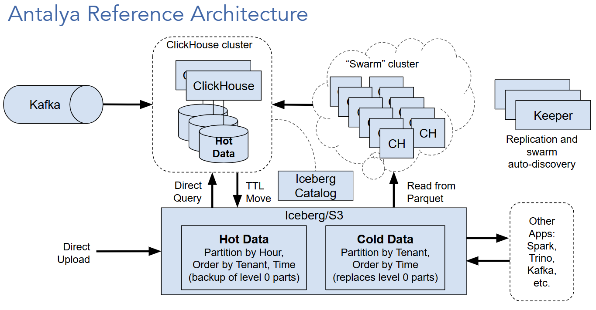

# Antalya Concepts Guide

## Overview

Antalya is an extended version of ClickHouse that offers all existing
capabilities plus additional features that allow Antalya clusters to
use Iceberg as shared storage. The following diagram shows the main 
parts of an Antalya installation. 

## ClickHouse Compatibility

Antalya builds are based on upstream ClickHouse and follow ClickHouse 
versioning. They are intended as drop-in replacements for the 
matching ClickHouse version as well as Altinity Stable Builds. 

## Iceberg, Parquet, and Object Storage

Antalya includes extended support for fast operation on Iceberg 
data lakes using Parquet data files on S3 compatible storage. Antalya
extensions include the following:

* Integration with Iceberg REST catalog (compatible with upstream)
* Parquet bloom filter support (compatible with upstream)
* Iceberg partition pruning (compatible with upstream)
* Parquet file metadata cache 
* Boolean and int type support on native Parquet reader (compatible with upstream)

## Iceberg Specification Support

Generally speaking Antalya Iceberg support matches upstream ClickHouse.
Antalya supports reading Iceberg V2. It cannot write to Iceberg
tables. For that you must currently use other tools, such as Spark
or pyiceberg.

There are a number of bugs and missing features in Iceberg support. If
you find something unexpected, please log an issue on the antalya-examples
project for now. 

### Iceberg Database Engine

The Iceberg database engine encapsulates the tables in a single Iceberg
REST catalog.  REST catalogs enumerate the metadata for Iceberg tables,
and the database engine makes them look like ClickHouse tables. This is
the most natural way to interate with Iceberg tables.

### Iceberg Table Engine and Table Function

Antalya offers Iceberg table engine and function just like upstream 
ClickHouse. They encapsulate a single table using the object storage
path to locate the table metadata and data. Currently only one table
can use the path. 

### Hive and Plain S3

Antalya can also read data directly from S3 as well as Hive format. 
The capabilities are largely identical to upstream ClickHouse. 

## Swarm Clusters

Antalya introduces the notion of swarm clusters, which are clusters of
stateless ClickHouse servers that can be used for parallel query to as
well as (in future) writes to Iceberg. Swarm clusters can scale up and
down quickly.

To use a swarm cluster you must first provision at least one Antalya
server to act as a query initiator. This server must have access to the
table schema, for example by connecting to an Iceberg database using the
`CREATE DATABASE ... Engine=Iceberg` command.

You can dispatch a query on S3 files or Iceberg tables to a swarm
cluster by adding the `object_storage_cluster = <swarm cluster name>`
setting to the query. You can also set this value in a profile or as as
session setting.

The Antalya initiator will parse the query, then dispatch subqueries to
nodes of the swarm for query on individual Parquet files. The results
are streamed back to the initiator, which merges them and returns final
results to the client application.

## Swarm Auto-Discovery using Keeper

Antalya uses Keeper servers to implement swarm cluster auto-discovery. 

1. Each swarm cluster can register itself in one or more clusters. Each 
   cluster is registered on a unique path in Keeper. 

2. Initiators read cluster definitions from Keeper. They are updated as 
   the cluster grows or shrinks. 

Antalya also supports the notion of an auxiliary Keeper server for cluster
discovery. This means that Antalya clusters can use one Keeper ensemble
to control replication, and another Keeper server for auto-discovery.

Swarm clusters do not use replication. They only need Keeper for
auto-discovery.

## Tiered Storage between MergeTree and Iceberg

Antalya will provide tiered storage between MergeTree and Iceberg tables. 
Tiered storage includes the following features. 

1. ALTER TABLE MOVE command to move parts from MergeTree to external 
   Iceberg tables.
2. TTL MOVE to external Iceberg table. Works as current tiered storage but will
   also permit different partitioning and sort orders in Iceberg. 
3. Transparent reads across tiered MergeTree / Iceberg tables. 

## Runtime Environment

Antalya servers can run anywhere ClickHouse does now. Cloud native
operation on Kubernetes provides a portable and easy-to-configure path
for scaling swarm servers. You can also run Antalya clusters on bare
metal servers and VMs, just as ClickHouse does today.

## Future Roadmap

Antalya has an active roadmap. Here are some of the planned features. 

* Extension of Altinity Backup for ClickHouse to support Antalya servers
  with Iceberg external tables.
* Automatic archiving of level 0 parts to Iceberg so that all data is 
  visible from the time of ingest.
* Materialized views on Iceberg tables. 
* Fast ingest using Swarm server. This will amortize the effort of generating
  Parquet files using cheap compute servers. 

There are many more possibilities. We're looking for contributors. Join
the fun!
